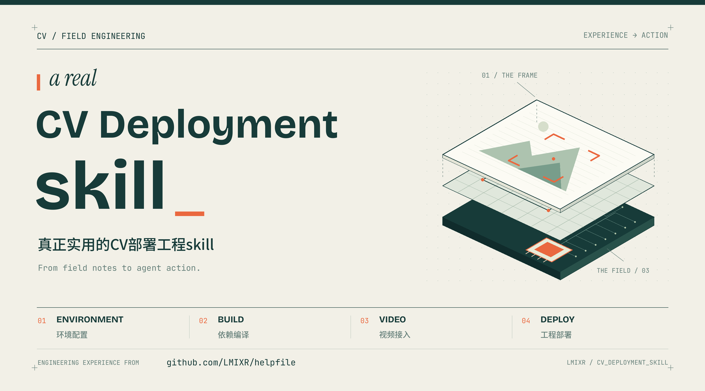

<p align="center">
  
</p>

<h1 align="center">a real CV Deployment skill</h1>

<p align="center"><strong>真正实用的CV部署工程skill</strong></p>

<p align="center">
  <strong>简体中文</strong> · <a href="README.en.md">English</a>
</p>

<p align="center">
  让 agent 把工程经验用在具体环境里：配环境、编依赖、接视频、做部署。
</p>

<p align="center">
  <a href="#开始使用">开始使用</a> ·
  <a href="#能做什么">能做什么</a> ·
  <a href="cv-deployment-skills/cv-deploy/SKILL.md">阅读 Skill</a> ·
  <a href="https://github.com/LMIXR/helpfile">经验来源：helpfile</a>
</p>

---

## 从工程经验到 agent 行动

**本项目的工程经验来自 [LMIXR/helpfile](https://github.com/LMIXR/helpfile)。**

helpfile 记录了 CV 工程落地中的环境配置、依赖编译、视频接入与部署经验。本项目将这些经验整理成 `$cv-deploy`：agent 先识别目标平台和项目约束，再按任务读取资料、选择方案，并在授权范围内执行操作。

历史版本、适用条件和排错线索一起保留。遇到不同系统、架构或依赖版本时，skill 引导 agent 先判断经验是否适用，再生成当前项目需要的命令和配置。

## 能做什么

| 环节 | 典型任务 | 经验指南 |
| --- | --- | --- |
| **01 · 环境配置** | Ubuntu / Jetson、NVIDIA、CUDA、网络与离线安装 | [环境与平台](cv-deployment-skills/cv-deploy/references/platforms.md) |
| **02 · 依赖编译** | OpenCV、Qt、推理框架、C++ 库、Python 与 ABI | [依赖编译](cv-deployment-skills/cv-deploy/references/build.md) |
| **03 · 视频接入** | FFmpeg、GStreamer、RTSP、ONVIF、GB28181 | [视频接入](cv-deployment-skills/cv-deploy/references/video.md) |
| **04 · 工程部署** | 动态库与插件打包、systemd、Windows 服务、Docker | [打包与部署](cv-deployment-skills/cv-deploy/references/deployment.md) |
| **配套服务** | MySQL、MongoDB、Redis、MinIO、Kafka、Tomcat | [数据与消息服务](cv-deployment-skills/cv-deploy/references/services.md) |
| **配套工具** | Ansible、Jenkins、Jitsi、移动端与其他工具 | [工具指南](cv-deployment-skills/cv-deploy/references/tools.md) |

资料涉及 **Ubuntu、CentOS、Windows、macOS、Jetson、树莓派、RK3399**，以及 Android / iOS 的部分配套工具。不同平台的经验深度不同，具体边界在指南中说明。

项目介绍提供中英文两版；技能正文与主题参考资料目前以中文编写。

## 开始使用

### 在本项目使用

技能已安装在 [`.agents/skills/cv-deploy/`](.agents/skills/cv-deploy/SKILL.md)。在支持该目录的 agent 中打开本仓库后调用：

```text
$cv-deploy 根据现有 CMake 配置，在 Ubuntu 上编译项目需要的 OpenCV 和 FFmpeg。
```

也可以从一个具体问题开始：

```text
$cv-deploy 排查 Jetson 上 RTSP 能连接但不能解码的问题，保留当前 JetPack。
$cv-deploy 用项目的 MSVC 和 Qt kit 编译 Windows 依赖，并整理发布目录。
$cv-deploy 把现有 WVP 和 ZLMediaKit 配置成服务，保留当前端口和数据目录。
$cv-deploy 只生成离线部署方案和配置文件，本次不执行安装或验证。
```

### 安装到其他项目

下载本仓库后，在**目标项目根目录**执行，替换下面的仓库路径：

```sh
mkdir -p .agents/skills
cp -R /path/to/CV_Deployment_skill/cv-deployment-skills/cv-deploy .agents/skills/
```

如果目标项目已有同名技能，先比较并合并本地修改。其他 agent 可将整个 `cv-deploy` 目录放入其支持的技能位置，或直接读取 `SKILL.md`。主题参考资料随技能分发，可以离线阅读。

## 工程经验来自哪里

- **原始经验仓库：[LMIXR/helpfile](https://github.com/LMIXR/helpfile)**。
- [来源索引](cv-deployment-skills/cv-deploy/references/source-index.md) 收录 **119 个工程文本来源链接**，可追溯原始笔记、脚本与配置。
- 原文中的个人路径、地址和口令未作为技能默认配置；旧版本组合保留为适用线索。

当前版本完成了经验整理与技能封装，尚未进行跨平台运行验收。实际使用时，执行范围与验证深度由任务要求决定。

## 仓库结构

```text
.agents/skills/
├── cv-deploy/                 项目安装版本
└── canvas-design/             项目封面设计工具
cv-deployment-skills/
├── README.md                  维护说明
└── cv-deploy/                 技能源文件与主题资料
docs/
├── assets/                    GitHub 封面
└── design/                    视觉设计理念与来源
```

维护 `cv-deployment-skills/cv-deploy/` 后，将变更同步到项目安装版本。欢迎在 [Issues](https://github.com/LMIXR/CV_Deployment_skill/issues) 补充真实部署场景，附上平台、版本、现象和相关日志，便于把新经验整理为可复用的指导。
